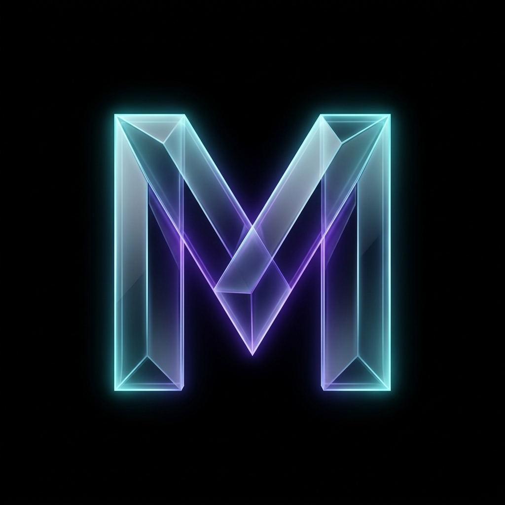
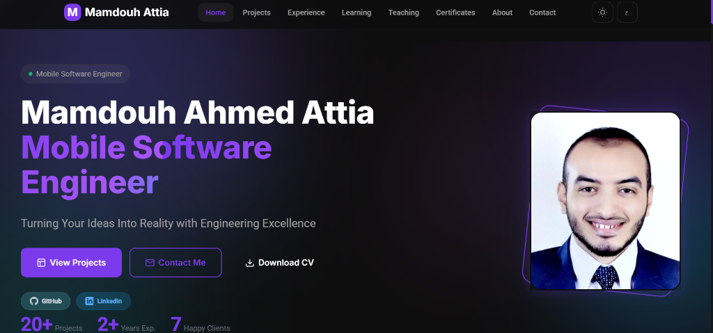
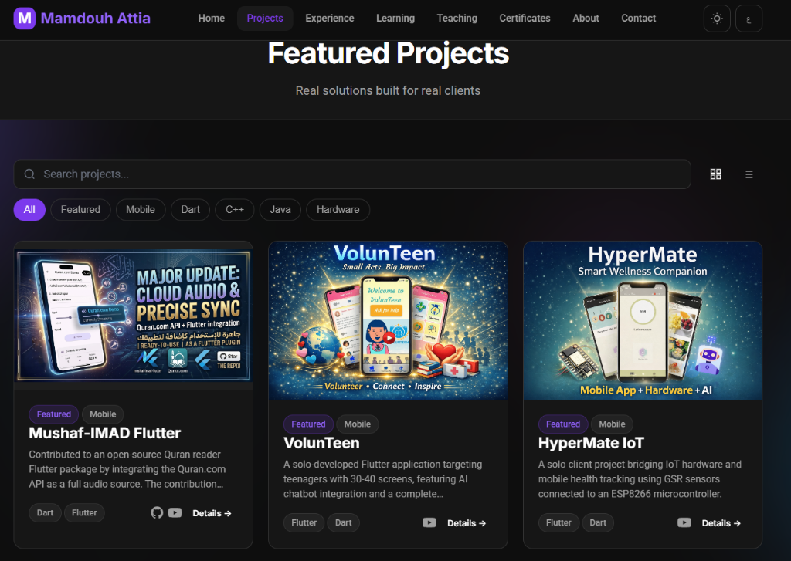
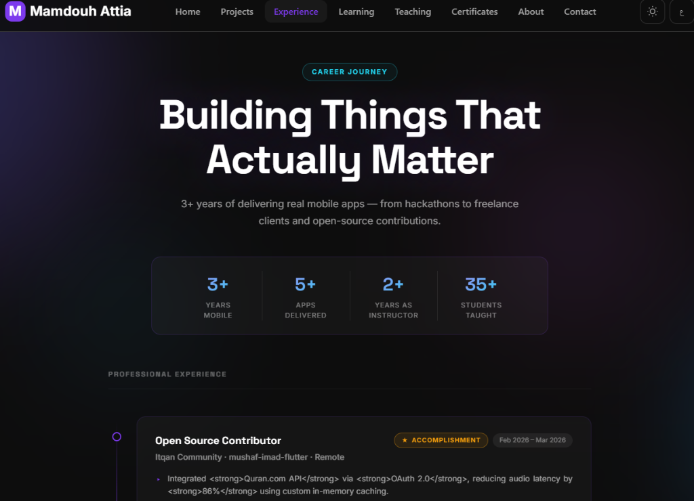
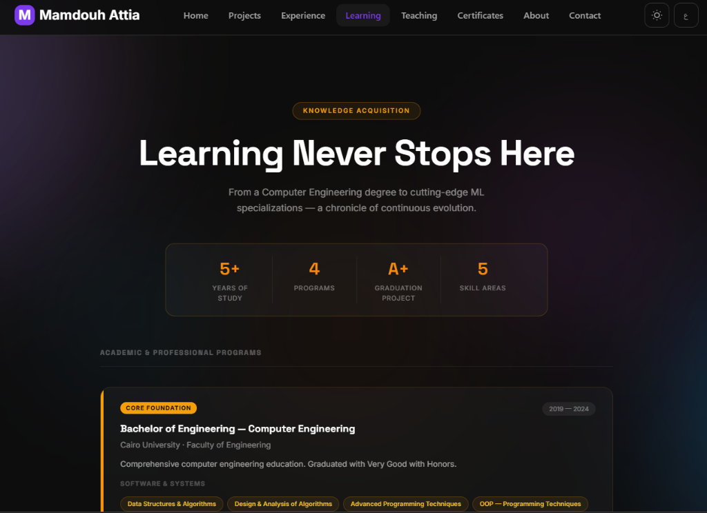
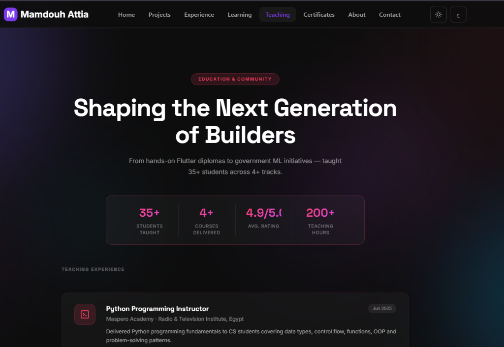

<div align="center">
  
  <h1>Mamdouh Ahmed Attia - Portfolio</h1>
  <p><strong>Mobile Software Engineer | Flutter Specialist</strong>
  <a href="https://mamdouh-attia.github.io/mamdouh_portfolio">Live Site</a>
  </p>
  <p><i>Turning Ideas Into Reality with Engineering Excellence</i></p>
</div>

<br/>

## 🎯 Overview

Welcome to the source code of my professional portfolio! This is a modern, responsive, and fully internationalized (i18n) web application built to showcase my career journey, professional projects, teaching roles, and academic achievements.

Designed with a premium "Glassmorphic" aesthetic and tailored with a "Celestial Architect" theme, the codebase emphasizes clean architecture, modular CSS, and vanilla JavaScript performance.

## ✨ Key Features

- **🌐 Full Internationalization (i18n):** Seamless LTR (English) and RTL (Arabic) switching with dynamic re-rendering.
- **🌗 Dark & Light Themes:** Context-aware adaptive theming with precision CSS variables, prioritizing a polished dark mode.
- **🎨 Glassmorphic UI:** Premium visual design using `backdrop-filter`, subtle animated gradients, and floating elements.
- **📱 Fully Responsive:** Carefully crafted layouts that look equally stunning on a 4K monitor or a mobile screen.
- **⚡ Zero-Dependencies Core:** Built purely on HTML, CSS, and Vanilla JavaScript for maximum performance and full control.

## 📸 Showcase


### Home & Hero Section


### Professional Projects


### Experience Timeline


### Academic & Learning Journey


### Teaching & Community


## 🛠️ Technical Ecosystem

This site was engineered from scratch without relying on heavy frameworks (like React or Vue), demonstrating a deep understanding of core web fundamentals.

- **Structure:** Semantic HTML5
- **Styling:** Modular CSS, CSS Variables (Design Tokens), Flexbox/Grid, Keyframe Animations
- **Logic:** Vanilla ES6 JavaScript, Object-Oriented patterns (e.g., `I18nManager`, `ThemeManager`)
- **Deployment:** GitHub Pages / Firebase Hosting
- **Assets:** Google Fonts (Inter, Roboto), Custom SVG iconography

## 📂 Project Structure

```text
📁 portfolio/
├── 📁 assets/          # Images, logos, and downloadable files (CV)
├── 📁 css/             # Modular stylesheets (globals, components, animations...)
├── 📁 i18n/            # Localization JSON files (en.json, ar.json)
├── 📁 js/              # Vanilla JavaScript modules and data objects
├── 📁 pages/           # Sub-pages (About, Projects, Experience, Learning, etc.)
└── index.html          # Main landing page
```

## 🚀 Getting Started

If you want to run this project locally to explore the architecture or tweak the UI:

1. **Clone the repository:**
   ```bash
   git clone https://github.com/Mamdouh-Attia/portfolio.git
   cd portfolio
   ```

2. **Run a local server:**
   Since this is a static site, you just need a simple HTTP server to avoid CORS issues when loading the JSON translation files. 
   - *Using Python:* `python -m http.server 8000`
   - *Using Node/NPM:* `npx serve .` or `npm run dev` (if scripts are configured)
   - *Using VS Code:* Use the "Live Server" extension.

3. **Open your browser:** Navigate to `http://localhost:8000`

## 📬 Let's Connect

Currently open for new opportunities and exciting freelance challenges. Check out the live portfolio:

- **LinkedIn:** [Mamdouh Attia](https://www.linkedin.com/in/mamdouh-atia/)
- **GitHub:** [Mamdouh-Attia](https://github.com/Mamdouh-Attia)
- **Live Site:** [Mamdouh Attia Portfolio](https://mamdouh-attia.github.io/portfolio/)

---
<div align="center">
  <sub>Built with passion and engineering excellence.</sub>
</div>
